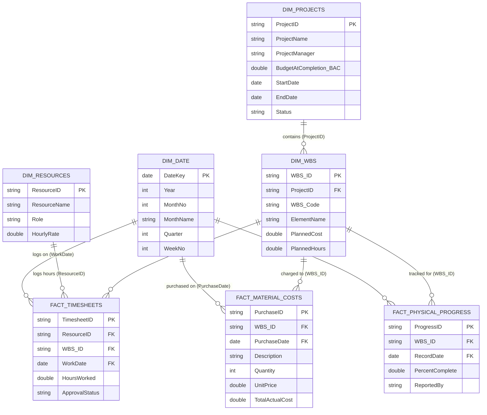

# Power BI & Excel Semantic Data Model & DAX Guide

This guide details the database design, ETL transformation steps, DAX measures, and visual hierarchy needed to build a professional project controlling reporting suite in Power BI and Excel.

---

## 1. Power BI Data Model (Star Schema)

For optimal query performance, table compression, and clean DAX calculations, the data model must be structured as a **Star Schema** (separating factual transactions from descriptive dimension lookup tables).



---

## 2. Power Query (M) Transformations & Enrichment

Apply the following steps during the **Get Data** phase to prepare and enrich the tables:

### Creating the Date Dimension (`Dim_Date`)

In Power BI, a continuous Date table is required for time-intelligence. Paste this M code into a Blank Query in Power Query editor:

```powerquery
let
    StartDate = #date(2026, 1, 1),
    EndDate = #date(2026, 12, 31),
    NumberOfDays = Duration.Days(EndDate - StartDate) + 1,
    DatesList = List.Dates(StartDate, NumberOfDays, #duration(1, 0, 0, 0)),
    TableFromList = Table.FromList(DatesList, Splitter.SplitByNothing(), {"Date"}),
    ChangedType = Table.TransformColumnTypes(TableFromList, {{"Date", type date}}),
    AddYear = Table.AddColumn(ChangedType, "Year", each Date.Year([Date]), Int64.Type),
    AddMonthNo = Table.AddColumn(AddYear, "MonthNo", each Date.Month([Date]), Int64.Type),
    AddMonthName = Table.AddColumn(AddMonthNo, "MonthName", each Date.MonthName([Date]), type text),
    AddQuarter = Table.AddColumn(AddMonthName, "Quarter", each Date.QuarterOfYear([Date]), Int64.Type),
    AddWeekNo = Table.AddColumn(AddQuarter, "WeekNo", each Date.WeekOfYear([Date]), Int64.Type)
in
    AddWeekNo
```

### Data Cleansing & Key Relations:

1. **Ensure Datatypes**: Force Date fields to `Date` type, ID fields to `Text`, and financial columns to `Decimal Number` or `Fixed Decimal Number` (Currency).
2. **Handle Nulls**: In `Fact_MaterialCosts` and `Fact_Timesheets`, ensure there are no blank foreign keys. Remove or route rows with missing `WBS_ID` or `ResourceID` to an error audit view.
3. **labor Cost Enrichment**: In `Fact_Timesheets`, merge the query with `Dim_Resources` on `ResourceID`, expand `HourlyRate`, and create a custom column `LaborCost = [HoursWorked] * [HourlyRate]`. This pre-calculates transaction costs before the data model loads.

---

## 3. Best Practice DAX Measures (EVM & Forecasting)

Organize all calculations in an empty table named **`_Measures`** to keep the model tidy.

### Base Metrics

```dax
BAC = SUM('Dim_WBS'[PlannedCost])
```

_Budget at Completion: The total planned budget of WBS tasks._

```dax
Actual Labor Cost = SUM('Fact_Timesheets'[LaborCost])
```

```dax
Actual Material Cost = SUM('Fact_MaterialCosts'[TotalActualCost])
```

```dax
AC = [Actual Labor Cost] + [Actual Material Cost]
```

_Actual Cost (AC): Total combined actual costs logged on the project._

---

### Progress & Earned Value (EV)

Calculating Earned Value requires identifying the **latest physical progress percent** for each WBS element up to the selected date.

```dax
Latest Percent Complete =
VAR SelectedDate = MAX('Dim_Date'[Date])
RETURN
SUMX(
    VALUES('Dim_WBS'[WBS_ID]),
    VAR LatestWBSProgressDate =
        CALCULATE(
            MAX('Fact_PhysicalProgress'[RecordDate]),
            'Fact_PhysicalProgress'[RecordDate] <= SelectedDate
        )
    RETURN
    CALCULATE(
        MAX('Fact_PhysicalProgress'[PercentComplete]),
        'Fact_PhysicalProgress'[RecordDate] = LatestWBSProgressDate
    )
)
```

_Returns the latest progress assessment for each task relative to the active date filter._

```dax
EV =
SUMX(
    VALUES('Dim_WBS'[WBS_ID]),
    [BAC] * [Latest Percent Complete]
)
```

_Earned Value (EV): The value of work physically completed (BAC _ % Complete).\*

---

### Performance Indices & Variances

```dax
CV = [EV] - [AC]
```

_Cost Variance (CV): Negative is over budget; positive is under budget._

```dax
CPI = DIVIDE([EV], [AC], 1.0)
```

_Cost Performance Index (CPI): >1.0 is favorable cost efficiency; <1.0 is unfavorable._

```dax
SV = [EV] - [PV]
```

_Schedule Variance (SV): Negative is behind schedule; positive is ahead of schedule._
_(Note: PV is modeled as a cumulative budget line over time)._

```dax
SPI = DIVIDE([EV], [PV], 1.0)
```

_Schedule Performance Index (SPI): >1.0 is ahead of schedule; <1.0 is behind schedule._

---

### Forecasts (Estimate at Completion)

```dax
EAC (Typical) =
DIVIDE([BAC], [CPI], [BAC])
```

_Estimate at Completion (EAC): Assuming current cost efficiencies (CPI) persist until project end._

```dax
EAC (Atypical) =
[AC] + ([BAC] - [EV])
```

_Atypical EAC: Assuming future work will be completed precisely on budget._

```dax
VAC = [BAC] - [EAC (Typical)]
```

_Variance at Completion (VAC): Expected deviation from budget at project end._

---

## 4. Stakeholder Visual Layout Best Practices

Create a 3-tab Power BI report targeting distinct user groups:

### Page 1: PM Operational Dashboard

- **Target**: Project Managers.
- **Layout Grid**:
  - **Top Row**: KPI Cards for `SPI`, `CPI`, and `Latest Percent Complete` (use Conditional Formatting: Green for >= 1.0, Red for < 0.95).
  - **Left Side**: Gantt Chart or WBS table showing tasks, start/end dates, and percent complete.
  - **Right Side**: Scatter chart plotting WBS elements (X-axis = SPI, Y-axis = CPI). Tasks in the bottom-left quadrant are immediate risks.
  - **Bottom**: Resource Allocation histogram showing actual hours logged vs. planned capacity.

### Page 2: CFO & Executive Financial Summary

- **Target**: CFO, Executives, and Program Board.
- **Layout Grid**:
  - **Top Row**: Financial Cards: `BAC (Total Budget)`, `AC (Total Spent)`, `EV (Value Built)`, `EAC (Forecasted Cost)`, `VAC (Projected Variance)`.
  - **Main Visual**: Cumulative S-Curve Chart.
    - **X-Axis**: Date (Months/Weeks).
    - **Y-Axis**: Cumulative PV (Planned S-Curve), Cumulative EV (Actual Work Built), Cumulative AC (Actual Costs).
    - _Visual Cue_: The gap between EV and AC immediately shows cash efficiency, and the gap between PV and EV shows schedule drift.
  - **Bottom**: Detailed financial breakdown table showing WBS hierarchy, BAC, AC, EV, CPI, EAC, and VAC.

### Page 3: Client progress report

- **Target**: Client Project Office.
- **Layout Grid**:
  - **Top Row**: Overall project completion percentage card, target finish date.
  - **Main Visual**: Milestone Trend Chart (Milestone target dates vs. actual completion dates).
  - **Bottom**: Descriptive text summary box explaining key project milestones and upcoming work packages.
