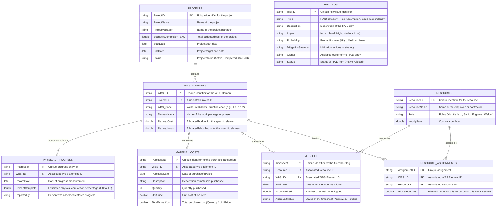

# Project Controlling Data Model (ERD)

This document describes a highly granular, relational database schema designed for modern project controlling and Earned Value Management (EVM). It is semantic-agnostic, meaning it is designed at the raw relational database level (SQL/CSV) and can be mapped to any semantic layer (like Power BI, Microsoft Dataverse, or DuckDB views).

## Entity-Relationship Diagram (ERD)

## Relational Rules & Integrity

1. **`PROJECTS` to `WBS_ELEMENTS`**: One-to-Many (`1:N`). A project contains multiple tasks or work packages structured hierarchically via the WBS code.
2. **`RESOURCES` to `RESOURCE_ASSIGNMENTS`**: One-to-Many (`1:N`). A resource can be assigned to multiple WBS elements.
3. **`WBS_ELEMENTS` to `RESOURCE_ASSIGNMENTS`**: One-to-Many (`1:N`). A WBS element can have multiple resource assignments (forming an `M:N` relationship between resources and WBS elements).
4. **`TIMESHEETS` (Granular Labor Costs)**: Tracks daily actual hours logged.
   - **Hourly Cost Calculation**: `Actual Labor Cost = HoursWorked * RESOURCES.HourlyRate`.
5. **`MATERIAL_COSTS` (Granular Materials)**: Captures non-labor actual costs invoiced directly to specific WBS elements.
6. **`PHYSICAL_PROGRESS` (EVM Driver)**: Periodic records of physical completion. Used to calculate **Earned Value (EV)** at any given date:
   - `EV = WBS_ELEMENTS.PlannedCost * PHYSICAL_PROGRESS.PercentComplete`.
