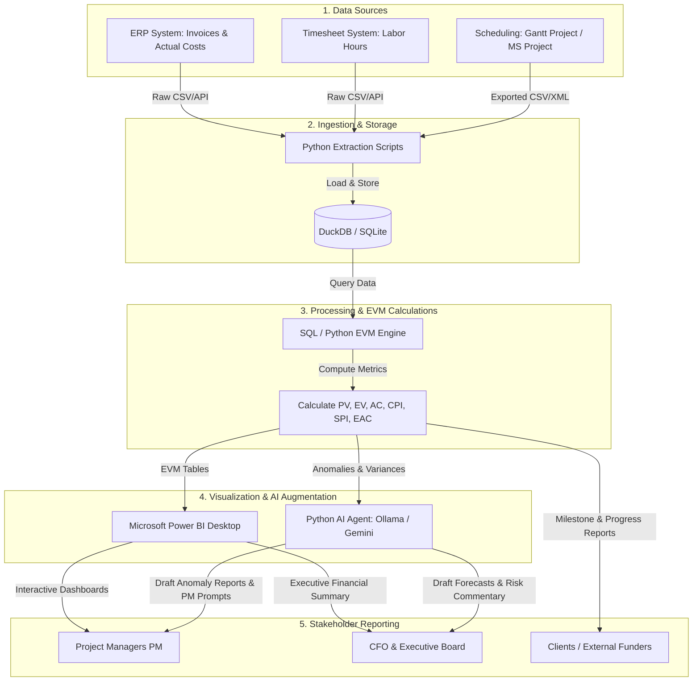

# Project Controlling Data Pipeline: Ingestion to Stakeholder Reporting

This document maps out a cost-effective, local-first data architecture. It shows how raw data from scheduling and ERP systems is ingested, processed using SQL and local AI, visualized in Power BI, and delivered as tailored reports to stakeholders.

---

## 1. Data Flow Chart (Architecture)

---

## 2. Step-by-Step Workflow Description

### Step 1: Data Sources & Formats
* **Scheduling Data**: Tasks, WBS codes, resource allocations, and start/end dates are maintained by planners.
* **Actual Cost & Labor Data**: Timesheets log actual hours worked by resources, and ERP systems capture purchase orders, invoices, and material costs.
* **Adjustments**: Manual schedule adjustments or progress updates (Percent Complete) are recorded weekly.

### Step 2: Ingestion & Storage (The Local Data Lake)
* **The Script**: A lightweight **Python script** runs on schedule (or manually) to fetch data from these source systems (either via REST APIs or directory file monitors).
* **The Engine**: Data is compiled into **DuckDB** (for analytical query speed) or **SQLite** (if transactional records are needed). This local database represents the single source of truth.

### Step 3: SQL Processing & EVM Engine
* SQL views query the database to calculate Earned Value Management (EVM) values at specific reporting dates:
  * **Planned Value (PV)**: Budget allocated to scheduled work.
  * **Actual Cost (AC)**: Labor cost (`hours * rate`) + material invoice cost.
  * **Earned Value (EV)**: Planned budget * physical completion percentage (`BAC * %_Complete`).
* The engine outputs indicators: **CPI** (Cost Performance Index), **SPI** (Schedule Performance Index), and **EAC** (Estimate at Completion).

### Step 4: Visualisation & AI Insights
* **Visual Dashboard (Power BI)**: Power BI Desktop loads the SQL views from DuckDB. It creates interactive dashboards (S-Curves, resource histograms, and traffic-light status cards).
* **AI Analysis Agent (Local LLM)**: 
  * A Python script queries the database for WBS elements where `CPI < 0.95` (over budget) or `SPI < 0.90` (behind schedule).
  * The script feeds these rows to a local LLM via **Ollama** (e.g., Llama 3) or the **Gemini API**.
  * The AI drafts an automated anomaly explanation: *"WBS 1.0 (Engineering) is currently at a CPI of 0.70. Actual hours exceed the plan by 40% due to an extended design iteration in Jan-Feb. Expected cost overrun is 119k USD."*

### Step 5: Tailored Stakeholder Reporting

Different stakeholders receive reports tailored to their role and level of detail:

1. **For Project Managers (PMs)**:
   * *Delivery*: Interactive Power BI dashboard + Daily AI anomaly prompts.
   * *Focus*: Tasks that are slip-prone (low SPI) or leaking money (low CPI). AI draft questions for PM review: *"We are seeing a drop in welding productivity on WBS 2.0; do we need to reassign resources?"*
2. **For the CFO & Executives**:
   * *Delivery*: High-level PDF executive brief + Portfolio summary dashboard.
   * *Focus*: **EAC Margin Variance** (will we hit our profit targets?), overall cash flow, and financial risk exposure. AI writes the first draft of the executive commentary.
3. **For Clients & Funders**:
   * *Delivery*: Formal progress reports showing physical milestone completion.
   * *Focus*: Validating milestone completion to trigger progress billing invoices.
