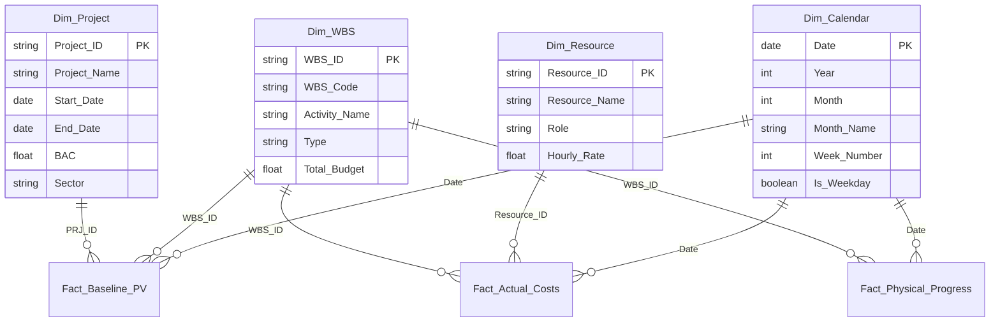

# Technical Documentation: Project Controlling Excel Application

This document provides a technical overview of the Project Controlling Excel workbook architecture, the data model (Star Schema), key Earned Value Management (EVM) calculation flows, dashboard design, and automation scripts.

---

## 1. Directory Structure & Assets

All project controlling assets and code are contained in the workspace root folder:
📂 `C:\Users\frank\Desktop\Project Mng\PM teori\Ex_Files_Excel_for_Project_Management`

### Key Files:
1. **Master Excel Template:**
   * [Master_Project_Controlling_Template.xlsx](file:///C:/Users/frank/Desktop/Project%20Mng/PM%20teori/Ex_Files_Excel_for_Project_Management/Master_Project_Controlling_Template.xlsx): Clean, generic workbook with dimensions, schedules, calculations, and dashboard layouts preserved, but specific transaction logs cleared (replaced with standard placeholders).
2. **Populated Test Workbook:**
   * [Test_Master_Mock_Populated_Final.xlsx](file:///C:/Users/frank/Desktop/Project%20Mng/PM%20teori/Ex_Files_Excel_for_Project_Management/Test_Master_Mock_Populated_Final.xlsx): Compiled workbook populated with mock data representing **PRJ999: Shipyard Assembly Beta** to test formulas, charts, and visualizations.
3. **SQLite Database:**
   * [Project_Controlling.db](file:///C:/Users/frank/Desktop/Project%20Mng/PM%20teori/Ex_Files_Excel_for_Project_Management/Project_Controlling.db): Local database loaded with all 36 extracted tables for transactional or analytics querying.
4. **Automation Script:**
   * [run_project_controlling_pipeline.py](file:///C:/Users/frank/Desktop/Project%20Mng/PM%20teori/Ex_Files_Excel_for_Project_Management/run_project_controlling_pipeline.py): One-click Python pipeline to reset the master template, generate mock CSVs, populate the test workbook, and apply formatting.

---

## 2. Relational Data Model (Star Schema)

The core analytical capabilities of the workbook rely on a normalized star schema:



---

## 3. Calculation Logic & Formula Flows

The workbook calculates EVM metrics dynamically at the WBS element level:

1. **Planned Value (PV):** Cumulative baseline budget allocated to work scheduled to be completed up to the reporting (status) date.
   $$\text{PV} = \text{SUM}(\text{Fact\_Baseline\_PV[Planned\_Value]}) \quad \text{where } \text{Date} \le \text{Status\_Date}$$
2. **Actual Cost (AC):** Cumulative actual spending logged for work performed up to the status date.
   $$\text{AC} = \text{SUM}(\text{Fact\_Actual\_Costs[Actual\_Cost]}) \quad \text{where } \text{Date} \le \text{Status\_Date}$$
3. **Earned Value (EV):** The budgeted cost of work actually performed, calculated by combining the baseline budget with the latest physical completion progress percentage:
   $$\text{EV} = \text{BAC (Dim\_WBS)} \times \text{Latest Physical Progress \%}$$
4. **Performance Indices:**
   * **CPI (Cost Performance Index):** $\frac{\text{EV}}{\text{AC}}$ (Values $< 1.0$ indicate budget overruns).
   * **SPI (Schedule Performance Index):** $\frac{\text{EV}}{\text{PV}}$ (Values $< 1.0$ indicate schedule slippage).
5. **Forecasts:**
   * **EAC (Estimate at Completion):** $\frac{\text{BAC}}{\text{CPI}}$
   * **ETC (Estimate to Complete):** $\text{EAC} - \text{AC}$
   * **VAC (Variance at Completion):** $\text{BAC} - \text{EAC}$

---

## 4. Visual Layouts & Chart Enhancements

The workbook integrates professional data visualization features compliant with Tufte's design principles:

### A. Cell-Based Gantt Chart (`Simple Gantt Model`)
* Renders schedules in weekly columns using lightweight conditional formatting.
* **Status Date Line:** Uses a dynamic formula `=AND(Control_Status_Date>=C$11, Control_Status_Date<C$11+7)` to format the week column matching the status date with a **red dotted left/right border** and a **light red background tint** (`#FDEDEC`).
* **Milestones:** Highlights gating milestones with a **gold fill** (`#FEF9E7`) and a gold border around the cell.

### B. EVM S-Curve Chart (`EVM Charts`)
* Plots Cumulative PV, Cumulative AC, and Cumulative EV lines over project weeks.
* **Variance Trends:** Automatically maps the cost variance (CV) and schedule variance (SV) as trendlines on the S-curve.
* **Data Labels:** Displays dynamic data labels directly on the CV/SV points so managers can read numerical variances in real-time.

---

## 5. Maintenance and Rebuilding
To update the project or load new data, run the one-click build pipeline:
```powershell
python run_project_controlling_pipeline.py
```
This script automates all steps, generating both clean templates and populated, visual-enhanced worksheets.
