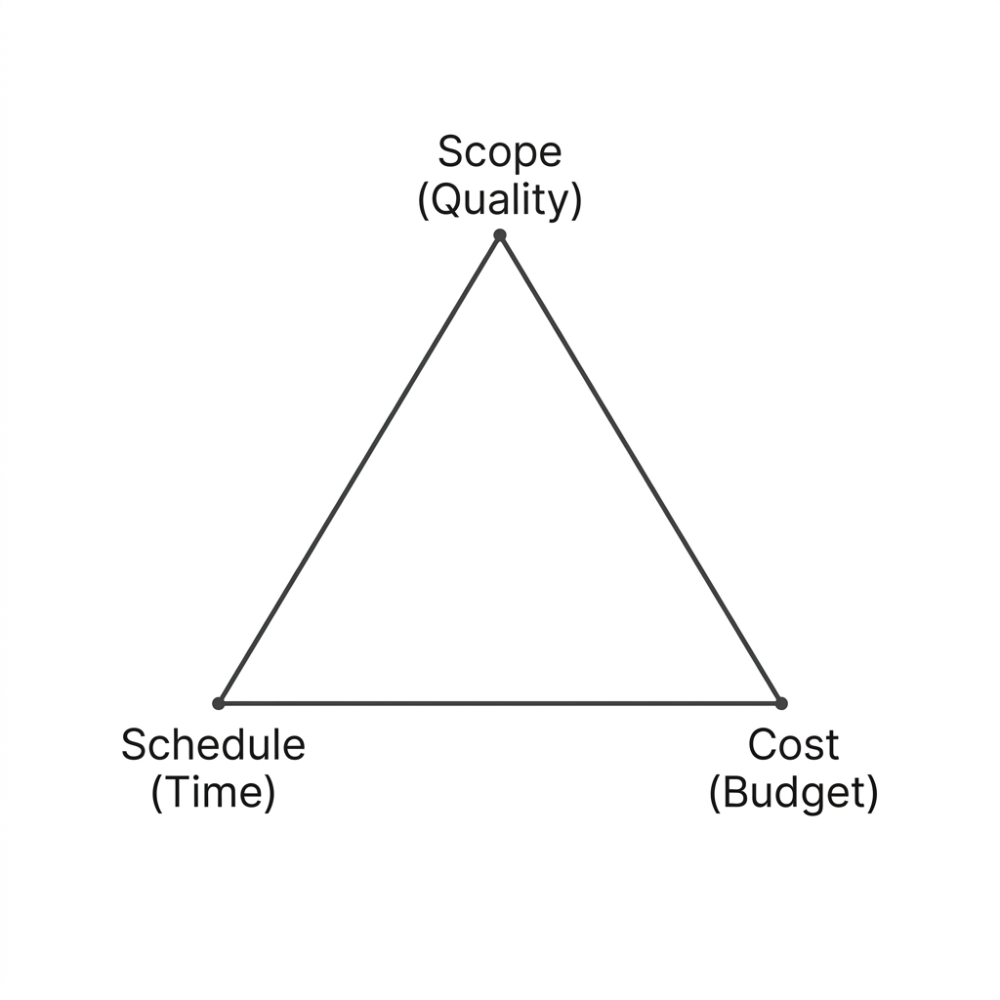
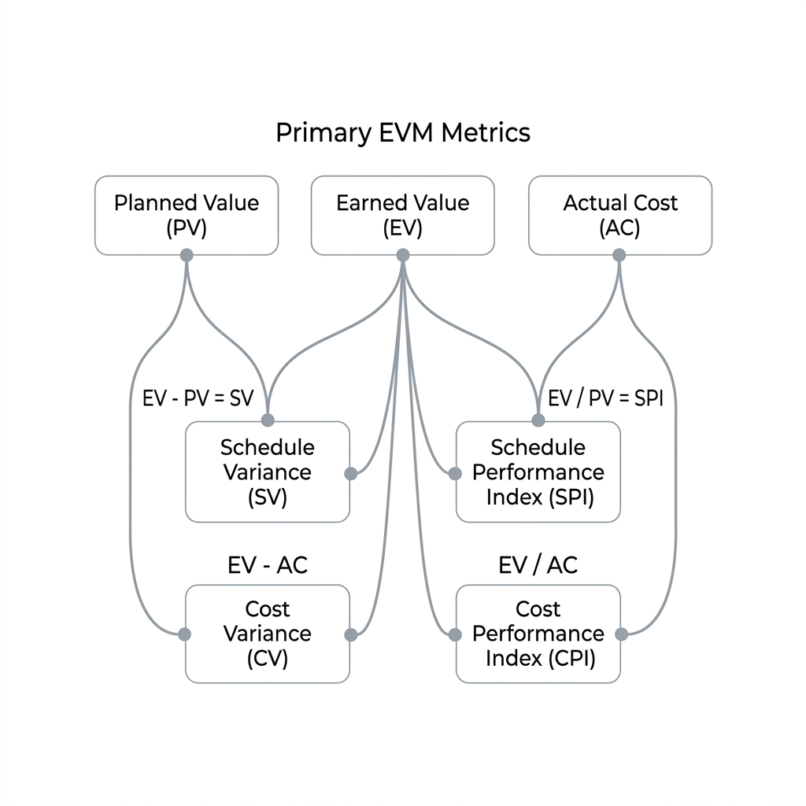
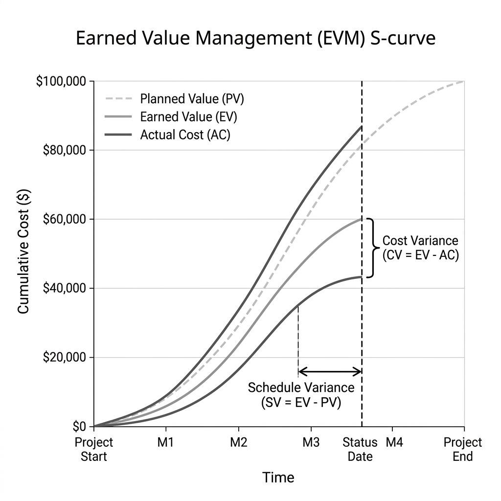

#### Project Management Triangle

- Cost-Scope-Schedule Triangle (also known as the Triple Constraint) is a model that describes the three primary constraints in project management: cost, scope, and schedule. These three elements are interdependent, meaning that changes to one constraint will likely affect the others.

- Cost: Refers to the budget allocated for the project. It includes all financial resources required to complete the project, such as labor, materials, equipment, and overhead costs.

- Scope: Defines the work that needs to be accomplished to deliver a product, service, or result with the specified features and functions. It outlines the project's objectives, deliverables, and boundaries.

- Schedule: Represents the timeline for completing the project, including the start and end dates, milestones, and deadlines. It involves planning and managing the time required to complete tasks and activities.

#### Earned Value Management (EVM)

- Earned Value Management (EVM) is a project management technique that integrates scope, schedule, and cost to assess project performance and progress. It provides a quantitative measure of project performance by comparing the planned value (PV), earned value (EV), and actual cost (AC).

- Planned Value (PV): The authorized budget assigned to the scheduled work to be accomplished. It represents the value of work that should have been completed at a specific point in time.

- Earned Value (EV): The value of work actually performed, expressed in terms of the approved budget. It indicates how much of the planned work has been completed at a specific point in time

- Actual Cost (AC): The actual cost incurred for the work performed during a specific period. It represents the total expenditure for the completed work.

- Cost Variance (CV): The difference between the earned value (EV) and the actual cost (AC). It indicates whether the project is under or over budget. CV = EV - AC.

- Schedule Variance (SV): The difference between the earned value (EV) and the planned value (PV). It indicates whether the project is ahead or behind schedule. SV = EV - PV.

- Cost Performance Index (CPI): A measure of cost efficiency, calculated as the ratio of earned value (EV) to actual cost (AC). CPI = EV / AC. A CPI greater than 1 indicates that the project is under budget, while a CPI less than 1 indicates that the project is over budget.

- Schedule Performance Index (SPI): A measure of schedule efficiency, calculated as the ratio of earned value (EV) to planned value (PV). SPI = EV / PV. An SPI greater than 1 indicates that the project is ahead of schedule, while an SPI less than 1 indicates that the project is behind schedule.

- Estimate at Completion (EAC): A forecast of the total cost of the project at completion, based on current performance. EAC can be calculated using different methods, depending on the project's performance trends.

- Variance at Completion (VAC): The difference between the original budget and the estimated cost at completion. VAC = BAC - EAC, where BAC is the Budget at Completion. A positive VAC indicates that the project is expected to be under budget, while a negative VAC indicates that it is expected to be over budget.

- To effectively implement EVM, project managers should establish a baseline plan, regularly monitor project performance, and analyze variances to make informed decisions and take corrective actions as needed.

- EVM provides valuable insights into project performance, enabling project managers to identify potential issues early, forecast future performance, and make data-driven decisions to keep the project on track.

- In summary, the Project Management Triangle and Earned Value Management are essential tools for project managers to balance cost, scope, and schedule while effectively monitoring and controlling project performance.

Baseline:
* Scope
* Cost
* Time

Planed value (PV): 
How much work should have been done by now (in terms of budget)?

Earned value (EV):
How much work have we actually done (in terms of value)?

Actual cost (AC):
How much money have we actually spent?

BAC: Budget at Completion - The total budget for the project.

CPI: Cost Performance Index - Measures the cost efficiency of the project. CPI = EV / AC
> 1 under budget
< 1 over budget

SPI: Schedule Performance Index - Measures the schedule efficiency of the project. SPI = EV / PV
> 1 ahead of schedule
< 1 behind schedule

EAC: Estimate at Completion - A forecast of the total cost of the project at completion, based on current performance. EAC can be calculated using different methods, depending on the project's performance trends.

VAC: Variance at Completion - The difference between the original budget and the estimated cost at completion. VAC = BAC - EAC, where BAC is the Budget at Completion. A positive VAC indicates that the project is expected to be under budget, while a negative VAC indicates that it is expected to be over budget.
