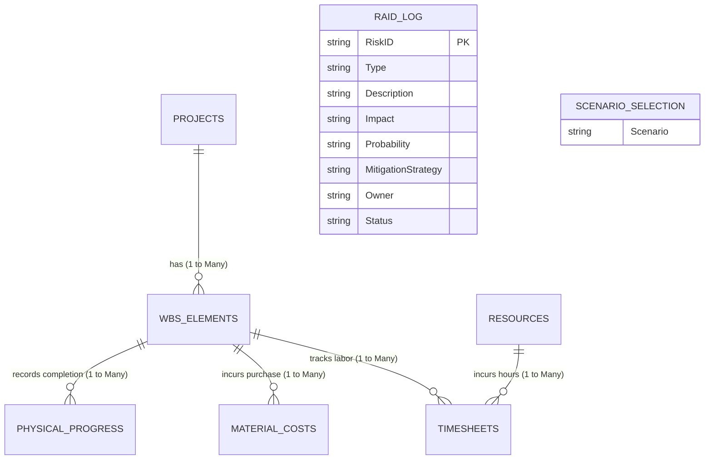

# Entity Relationship Diagram (ERD) Model — `project_wessels`

This document details the relational schema, tables, column data types, and cardinality relationships defined in the tabular semantic model.

## 1. Mermaid Entity Relationship Diagram (ERD)

---

## 2. Table Specifications

### `projects`
* **Purpose**: Primary dimensions table representing project metadata and baselines.
* **Columns**:
  * `ProjectID` (String, Primary Key)
  * `ProjectName` (String)
  * `ProjectManager` (String)
  * `BudgetAtCompletion_BAC` (Double / Numeric)
  * `StartDate` (DateTime / Date)
  * `EndDate` (DateTime / Date)
  * `Status` (String)

### `wbs_elements`
* **Purpose**: Work Breakdown Structure elements representing lower-level scopes.
* **Columns**:
  * `WBS_ID` (String, Primary Key)
  * `ProjectID` (String, Foreign Key -> `projects.ProjectID`)
  * `WBS_Code` (String)
  * `ElementName` (String)
  * `PlannedCost` (Double / Numeric)
  * `PlannedHours` (Double / Numeric)

### `resources`
* **Purpose**: Staff members, engineers, and crew roles.
* **Columns**:
  * `ResourceID` (String, Primary Key)
  * `ResourceName` (String)
  * `Role` (String)
  * `HourlyRate` (Double / Numeric)

### `timesheets`
* **Purpose**: Transactional log recording hours worked on specific WBS elements.
* **Columns**:
  * `TimesheetID` (String, Primary Key)
  * `ResourceID` (String, Foreign Key -> `resources.ResourceID`)
  * `WBS_ID` (String, Foreign Key -> `wbs_elements.WBS_ID`)
  * `WorkDate` (DateTime / Date)
  * `HoursWorked` (Double / Numeric)
  * `ApprovalStatus` (String)
  * `LaborCost` (Calculated Column: `HoursWorked` * `HourlyRate`)

### `material_costs`
* **Purpose**: Purchase logs mapping non-labor expenditures to WBS elements.
* **Columns**:
  * `PurchaseID` (String, Primary Key)
  * `WBS_ID` (String, Foreign Key -> `wbs_elements.WBS_ID`)
  * `PurchaseDate` (DateTime / Date)
  * `Description` (String)
  * `Quantity` (Int64)
  * `UnitPrice` (Double / Numeric)
  * `TotalActualCost` (Double / Numeric)

### `physical_progress`
* **Purpose**: Status records tracking % physical completion milestones over time.
* **Columns**:
  * `ProgressID` (String, Primary Key)
  * `WBS_ID` (String, Foreign Key -> `wbs_elements.WBS_ID`)
  * `RecordDate` (DateTime / Date)
  * `PercentComplete` (Double / Percentage)
  * `ReportedBy` (String)

---

## 3. Relationships Schema

All relationships are unidirectional, filtering from dimension tables (one) to fact tables (many):

1. **`rel_project_wbs`**:
   * `projects.ProjectID` **(1)** ──> **(∞)** `wbs_elements.ProjectID`
2. **`rel_wbs_timesheets`**:
   * `wbs_elements.WBS_ID` **(1)** ──> **(∞)** `timesheets.WBS_ID`
3. **`rel_resources_timesheets`**:
   * `resources.ResourceID` **(1)** ──> **(∞)** `timesheets.ResourceID`
4. **`rel_wbs_material_costs`**:
   * `wbs_elements.WBS_ID` **(1)** ──> **(∞)** `material_costs.WBS_ID`
5. **`rel_wbs_physical_progress`**:
   * `wbs_elements.WBS_ID` **(1)** ──> **(∞)** `physical_progress.WBS_ID`
